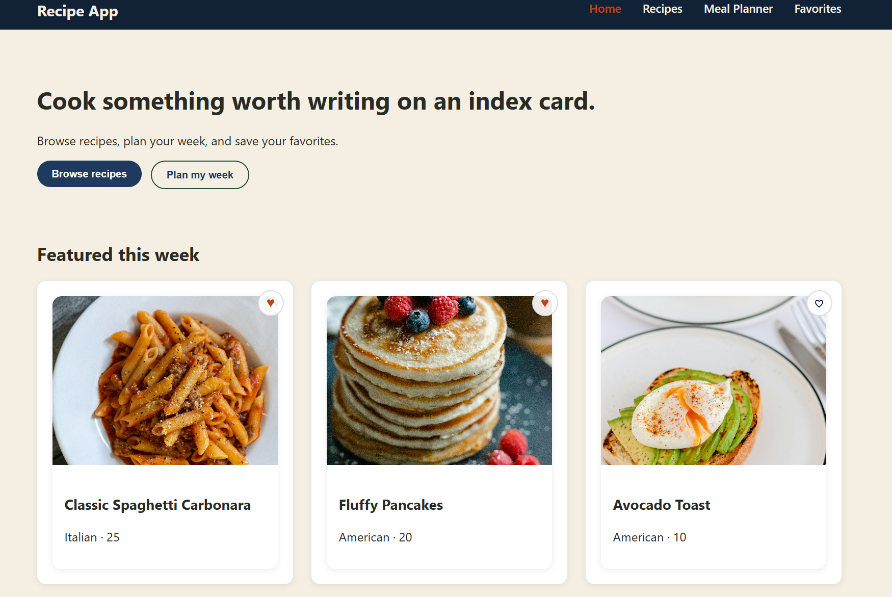
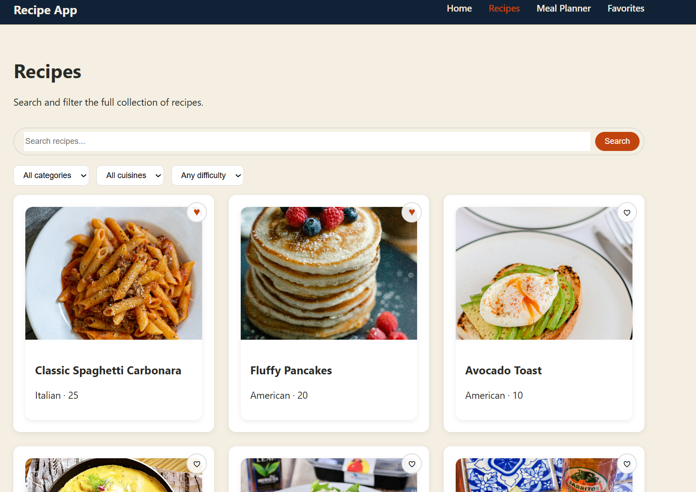
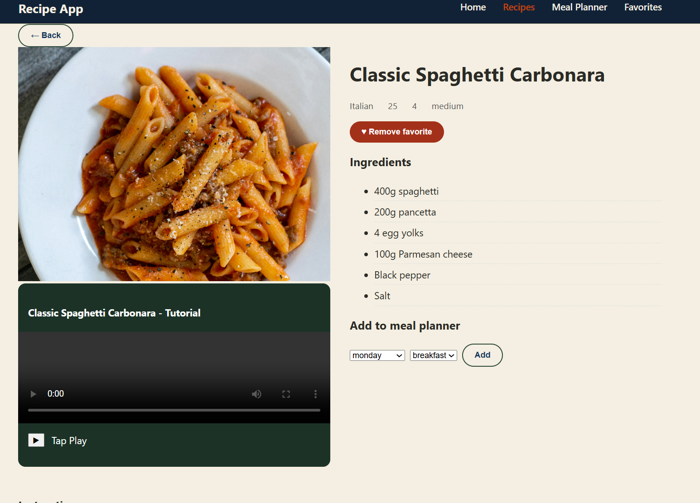
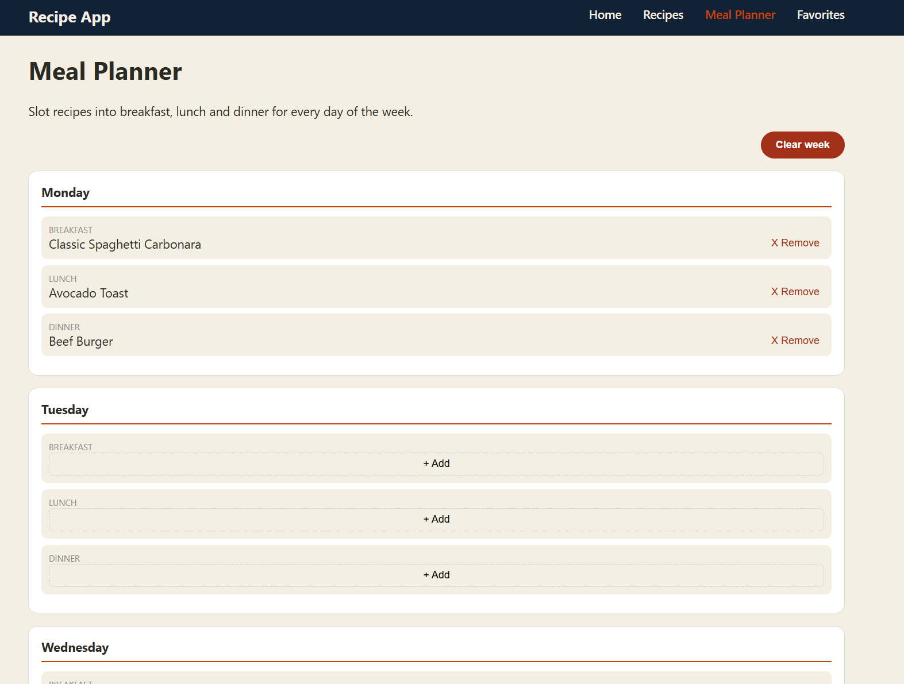
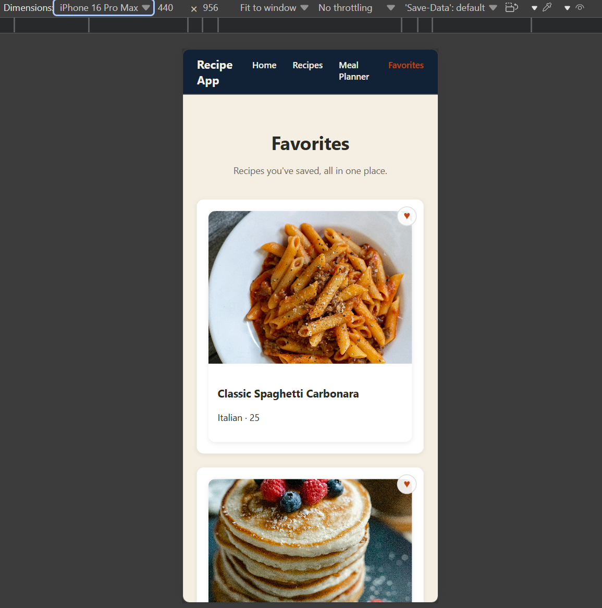

# Recipe App

A recipe discovery and weekly meal planning app. You can browse available recipes, search, filter and watch tutorials and save favorites recipes.

## Features List:

- Browse recipes by title, category, cuisine, and difficulty
- Search bar and filtering functionality
- Has a recipe detail page which shows ingredients, instructions and a tutorial
- You can add meals as favorites or unfavorite meals from recipes page or recipe detail page
- Weekly meal planner with breakfast, lunch and dinner slots
- Responsive navigation
- A custom 404 page for routes that do not exist

## Technologies Used:

- React
- React router dom
- PropTypes
- CSS modules
- Vite
- Browser localstorage

## Component Architecture:

All shared state is owned by `App.jsx` and is sent down as props to routed pages. Instead of being duplicated, smaller components like `RecipeCard` and `Card` are reused across several pages.

## Installation Instructions and How to View:

- Clone repo using `git clone https://github.com/Umuzi-skillslab/react-recipe-app-richardcodez.git`
- Open project folder where its cloned
- cd to recipe-app using `cd ./recipe-app`
- run this command `npm install`
- run this command to get the app running locally `npm run dev`
- open the localhost link that pops up in the terminal after a successful run

## Project Structure:

- **components/** - grouped by feature (Recipe, MealPlanner, Media) or by shared purpose (UI, common, navigation)
- **pages/** - one file per route, composed from smaller components
- **data/** - the static recipe catalog
- **data/** - static recipe data catalog
- **utils/** - sahred constants and pure functions used across multiple components, avoids duplicated logic

## Component Descriptions:

- **Navbar** - sticky navigation with active-route styling
- **Button /Card / Search / Loading / Modal** - reusable UI primitives used throughout the app
- **RecipeCard** - a single recipe summary with a favorite toggle button, reused on `Home, Recipes, Favorites and inside the meal planner picker`
- **RecipeDetail** - full recipe view: ingredients, instructions, embedded video, and controls to favorite or add the recipe to the meal plan
- **RecipeFilter** - category/cuisine/difficulty dropdowns with a clear-filters option
- **MealPlanner / DayCard** - the 7-day planner, DayCard is reused once per day and opens a recipe-picker Modal when a slot is empty
- **VideoPlayer / AudioPlayer** - custom play/pause controls wrapped around native HTML5 video/audio elements

## State Management:

- Several pages must read and update the same data, therefore `App.jsx` maintains `recipes`, `favorites`, and `mealPlan` as the single source of truth. Using paired `useEffect` hooks, `favorites` and `mealPlan` are stored to localStorage. One hook loads saved data upon mount, while the other saves whenever that state changes, skipping the first render to avoid overwriting saved data with the initial empty state.
- User actions flow back up via callback props (`onFavoriteToggle`, `onAddMeal`, `onRemoveMeal`) set in `App.jsx`; data flows down to pages as props. Instead of being lifted needlessly, page-local issues, search text, active filters and the meal slot being edited remain within the component that owns them.

## Routing:

| Path | Page | Notes |
|---|---|---|
| `/` | Home Page | Featured recipes, cooking tip |
| `/recipes` | Recipes Page | Search and filter |
| `/recipes/:id` | RecipeDetail | Dynamic route parameter used |
| `/meal-planner` | Meal Planner Page | weekly planner, monday to sunday |
| `/favorites` | Favorites Page | Saved recipes |
| `*` | NotFound Page | 404 fallback for routes that do not exist |

## Future Enhancements:

Some of the potential future features that can be added to the Recipe App to enhance user experience are listed below.

- Real backend and user accounts instead of localStorage
- Drag and drop recipes directly onto meal planner slots
- Auto generated shopping list from a week's planned meals
- User submitted recipes and ratings
- Nutrition information per recipe

## Screenshots:

### Home Page

### Recipe Page

### Recipe Detail Page

### Meal Planner Page

### Mobile Responsive View
